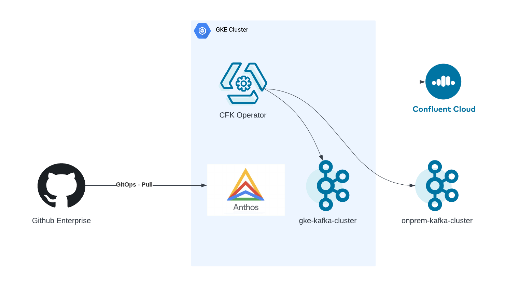
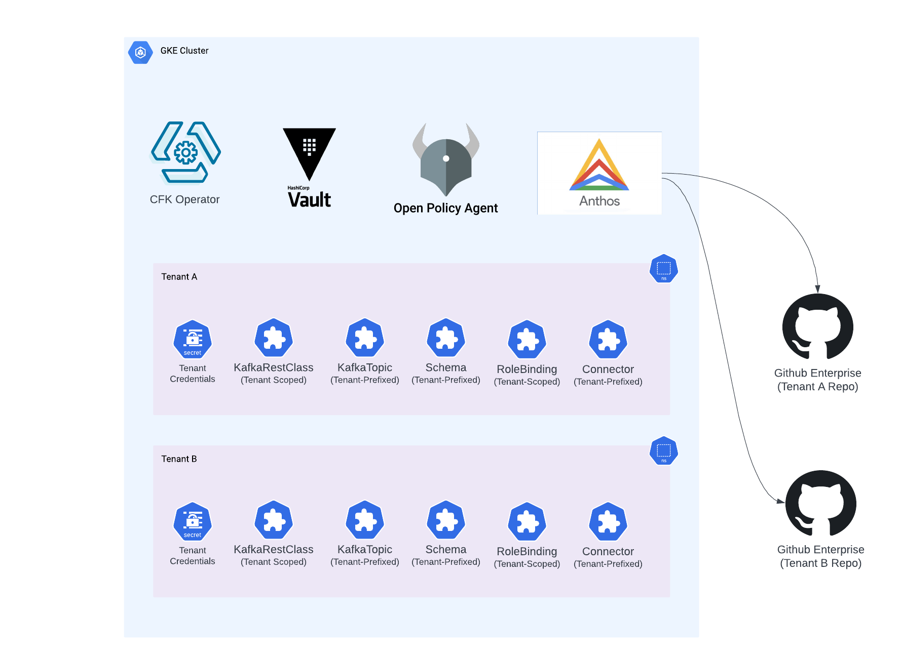

# Confluent For Kubernetes for assets management

### Why move away from JulieOps? 

JulieOps development was officially abandoned Nov 25, 2022. No new features or bugfixes are expected, therefore we need to look for officially supported tools to manage Kafka assets. Aside from the lack of official or community support, there is also some missing functionality as can be seen in the table below.

| feature                  | CFK | JulieOps | Comment                                |
| ------------------------ | --- | -------- | -------------------------------------- |
| Topics                   | ✅   | ✅        |                                        |
| Schemas                  | ✅   | ⚠️        | JulieOps only supports schema creation |
| Schema References        | ✅   | ❌        |                                        |
| Connectors               | ✅   | ⚠️        | JulieOps doesn't support updates 🐛     |
| RoleBindings             | ✅   | ✅        | JulieOps URL encoding 🐛               |
| ACLs                     | ❌   | ✅        | CFK doesn't support ACLs               |
| ClusterLinks             | ✅   | ❌        |                                        |
| SchemaExporters          | ✅   | ❌        |                                        |
| anti-entropy enforcement | ✅   | ❌        | CFK prevents configuration drifting    |

### Demo 

- [x] Support for Multi-Cluster: CFK can manage assets across on-premise (cp-ansible), Kubernetes-based (CFK) and fully managed (Confluent Cloud) clusters.

- [x] Support for Schema References in Protobuf
- [x] Governance and Policy-as-Code enforcement with OPA/Gatekeeper
- [x] Support for opt-in continuous reconciliation via annotations 
- [x] GitOps workflow and Multi-Tenancy security model 

